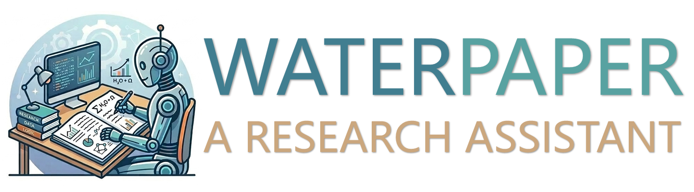

<h1>WATERPAPER: An End-to-End Research Assistant</h1>



Waterpaper, with a minimalist design, automatically transforms your idea into a paper.

## Introduction

Waterpaper includes a key document, `flow.md`, which describes a general research process that starts from a rough idea.

Waterpaper also includes an orchestrator, `run_research.py`, which is generated and refined by a coding agent. This orchestrator follows the process described in `flow.md`.

Waterpaper provides a template `Input.md` to help structure the initial idea for the agent.

## Requirements

Make sure Claude Code or Codex is installed. Currently, Waterpaper has only been tested with Claude Code.

## How to start

1. Create a working directory, for example `work3`.
2. Fill in `Input.md` with your original idea, and drop it into the working directory, for example `work3/Input.md`. There are five blanks (Original ideas, Reference sources, Method hints, Experimental thoughts, Paper format) in `Input.md` that require completion.
3. Run the flow with the following command, and we will obtain `paper.pdf` in the working directory, for example `work3/paper.pdf`.

   ```bash
   python run_research.py
   ```

## Tips

1. Pre-configuring the environment and data ensures smoother agent execution.
2. Describe your idea in detail as much as possible.
3. You can adjust `flow.md` according to your expertise.
